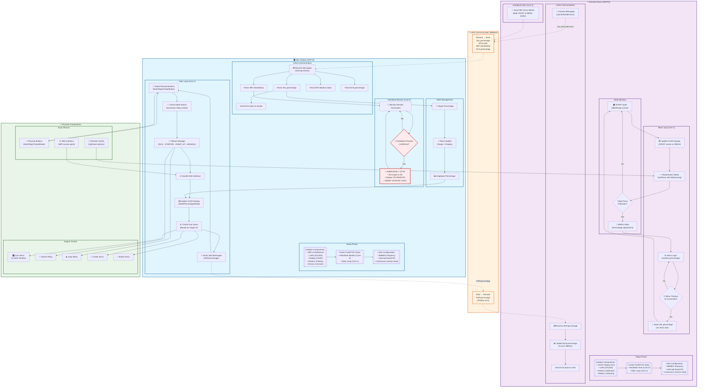

# RiiWynch System Flowchart

```mermaid
flowchart TD
    %% Main Display System
    subgraph MainDisplay ["🖥️ Main Display (ESP32)"]
        direction TB

        subgraph Setup_Main ["Setup Phase"]
            MD_Init[["Initialize Components:<br/>• WiFi & WebServer<br/>• LoRa (SX1262)<br/>• Display (OLED)<br/>• Buttons & Relays<br/>• Servos & Sensors"]]
            MD_Tasks[["Create FreeRTOS Tasks:<br/>• Heartbeat Monitor (Core 0)<br/>• Main Loop (Core 1)"]]
            MD_LoRa_Init[["LoRa Configuration:<br/>• 868MHz frequency<br/>• Interrupt-based RX<br/>• Continuous receive mode"]]
        end

        subgraph Main_Loop ["Main Loop (Core 1)"]
            MD_Buttons["📱 Read Physical Buttons<br/>(Start/Stop/Choke/Brake)"]
            MD_Mode_Check["🔄 Check Mode Switch<br/>(Up+Down+Stop combo)"]
            MD_Startup["🚀 Startup Manager<br/>(IDLE→STARTER→RAMP_UP→MANUAL)"]
            MD_WebUI["🌐 Handle Web Interface"]
            MD_Display_Update["📺 Update OLED Display<br/>(State/Percentage/Mode)"]
            MD_Servo_Control["⚙️ Control Gas Servo<br/>(Based on Target %)"]
            MD_LoRa_TX["📡 Send LoRa Messages<br/>(DSP,percentage)"]
        end

        subgraph Heartbeat_Task ["Heartbeat Monitor (Core 0)"]
            HB_Monitor["👀 Monitor Remote Connection"]
            HB_Timeout{"⏰ Heartbeat Timeout<br/>(>2000ms)?"}
            HB_Emergency["🛑 EMERGENCY STOP<br/>• Set target to 0%<br/>• Display 'NO REMOTE'<br/>• Update connection status"]
        end

        subgraph LoRa_Main ["LoRa Communication"]
            MD_LoRa_RX["📥 Receive Messages<br/>(Interrupt-driven)"]
            MD_Parse_VAL["Parse VAL,percentage"]
            MD_Parse_HBT["Parse HBT (Heartbeat)"]
            MD_Parse_BTN["Parse BTN (Button state)"]
            MD_Parse_ACK["Parse ACK,percentage"]
            MD_Send_ACK["Send ACK back to remote"]
        end

        subgraph State_Mgmt ["State Management"]
            SM_Target["🎯 Target Percentage"]
            SM_Displayed["📊 Displayed Percentage"]
            SM_Direct["⚡ Direct Update<br/>(Target = Display)"]
        end
    end

    %% Remote Device System
    subgraph Remote ["📱 Remote Device (ESP32)"]
        direction TB

        subgraph Setup_Remote ["Setup Phase"]
            R_Init[["Initialize Components:<br/>• OLED Display (I2C)<br/>• LoRa (SX1262)<br/>• Buttons (Up/Down)<br/>• Battery monitoring"]]
            R_Tasks[["Create FreeRTOS Tasks:<br/>• Heartbeat Task (Core 0)<br/>• Main Loop (Core 1)"]]
            R_LoRa_Init[["LoRa Configuration:<br/>• 868MHz frequency<br/>• Interrupt-based RX<br/>• Continuous receive mode"]]
        end

        subgraph Remote_States ["State Machine"]
            R_START["🏠 START State<br/>(Idle/Ready screen)"]
            R_MENU["📝 MENU State<br/>(Percentage adjustment)"]
            R_Triple_Press{"Triple Press<br/>Detection?"}
        end

        subgraph Remote_Loop ["Main Loop (Core 1)"]
            R_Button_Read["📱 Read Button States<br/>(Up/Down with debouncing)"]
            R_Display_Update["📺 Update OLED Display<br/>(START screen or MENU)"]
            R_Menu_Logic["⚙️ Menu Logic<br/>(Inc/Dec percentage)"]
            R_Timeout_Check{"⏰ Menu Timeout<br/>(1.5 seconds)?"}
            R_Send_VAL["📡 Send VAL,percentage<br/>(on menu exit)"]
        end

        subgraph Remote_HB ["Heartbeat Task (Core 0)"]
            R_HB_Send["📡 Send HBT every 500ms<br/>(Both START & MENU states)"]
        end

        subgraph Remote_LoRa ["LoRa Communication"]
            R_LoRa_RX["📥 Receive DSP,percentage"]
            R_Update_Display["📊 Update local percentage<br/>(if not in MENU)"]
            R_Send_ACK_R["Send ACK back to main"]
            R_LoRa_TX["📡 Transmit Messages<br/>(VAL/BTN/HBT/ACK)"]
        end
    end

    %% LoRa Communication Channel
    subgraph LoRa_Channel ["📡 LoRa Communication (868MHz)"]
        direction LR
        Main_to_Remote["Main → Remote<br/>DSP,percentage<br/>(Display sync)"]
        Remote_to_Main["Remote → Main<br/>VAL,percentage<br/>BTN,state<br/>HBT (Heartbeat)<br/>ACK,percentage"]
    end

    %% Physical Components
    subgraph Physical ["🔧 Physical Components"]
        direction TB

        subgraph Engine_Control ["Engine Control"]
            Gas_Servo["🎛️ Gas Servo<br/>(0-100% throttle)"]
            Start_Relay["🔌 Starter Relay"]
            Stop_Relay["⏹️ Stop Relay"]
            Choke_Servo["🌀 Choke Servo"]
            Brake_Servo["🛑 Brake Servo"]
        end

        subgraph Input_Devices ["Input Devices"]
            Physical_Buttons["🔘 Physical Buttons<br/>(Start/Stop/Choke/Brake)"]
            Web_Interface["🌐 Web Interface<br/>(WiFi access point)"]
            Remote_Controls["📱 Remote Control<br/>(Up/Down buttons)"]
        end
    end

    %% Flow Connections - Setup
    MD_Init --> MD_Tasks
    MD_Tasks --> MD_LoRa_Init
    R_Init --> R_Tasks
    R_Tasks --> R_LoRa_Init

    %% Flow Connections - Main Display Loop
    MD_Buttons --> MD_Mode_Check
    MD_Mode_Check --> MD_Startup
    MD_Startup --> MD_WebUI
    MD_WebUI --> MD_Display_Update
    MD_Display_Update --> MD_Servo_Control
    MD_Servo_Control --> MD_LoRa_TX
    MD_LoRa_TX --> MD_Buttons

    %% Flow Connections - Heartbeat Monitor
    HB_Monitor --> HB_Timeout
    HB_Timeout -->|Yes| HB_Emergency
    HB_Timeout -->|No| HB_Monitor
    HB_Emergency --> HB_Monitor

    %% Flow Connections - LoRa Main
    MD_LoRa_RX --> MD_Parse_VAL
    MD_LoRa_RX --> MD_Parse_HBT
    MD_LoRa_RX --> MD_Parse_BTN
    MD_LoRa_RX --> MD_Parse_ACK
    MD_Parse_VAL --> SM_Target
    MD_Parse_VAL --> MD_Send_ACK
    MD_Parse_HBT --> HB_Monitor

    %% Flow Connections - State Management
    SM_Target --> SM_Direct
    SM_Direct --> SM_Displayed
    SM_Displayed --> MD_Display_Update

    %% Flow Connections - Remote Loop
    R_Button_Read --> R_Triple_Press
    R_Triple_Press -->|Yes| R_MENU
    R_Triple_Press -->|No| R_START
    R_START --> R_Display_Update
    R_MENU --> R_Menu_Logic
    R_Menu_Logic --> R_Timeout_Check
    R_Timeout_Check -->|Yes| R_Send_VAL
    R_Timeout_Check -->|No| R_Menu_Logic
    R_Send_VAL --> R_START
    R_Display_Update --> R_Button_Read

    %% Flow Connections - Remote LoRa
    R_LoRa_RX --> R_Update_Display
    R_Update_Display --> R_Send_ACK_R

    %% Flow Connections - LoRa Channel
    MD_LoRa_TX -.->|DSP,percentage| Main_to_Remote
    Main_to_Remote -.-> R_LoRa_RX
    R_LoRa_TX -.->|VAL,BTN,HBT,ACK| Remote_to_Main
    Remote_to_Main -.-> MD_LoRa_RX
    R_HB_Send -.-> Remote_to_Main

    %% Flow Connections - Physical Components
    MD_Servo_Control --> Gas_Servo
    MD_Startup --> Start_Relay
    MD_Startup --> Stop_Relay
    MD_Buttons --> Physical_Buttons
    Physical_Buttons --> MD_Buttons
    Web_Interface --> MD_WebUI
    Remote_Controls --> R_Button_Read
    MD_Servo_Control --> Choke_Servo
    MD_Servo_Control --> Brake_Servo

    %% Styling
    classDef mainSystem fill:#e1f5fe,stroke:#01579b,stroke-width:2px
    classDef remoteSystem fill:#f3e5f5,stroke:#4a148c,stroke-width:2px
    classDef loraSystem fill:#fff3e0,stroke:#e65100,stroke-width:2px
    classDef physicalSystem fill:#e8f5e8,stroke:#1b5e20,stroke-width:2px
    classDef criticalPath fill:#ffebee,stroke:#c62828,stroke-width:3px

    class MainDisplay,Setup_Main,Main_Loop,Heartbeat_Task,LoRa_Main,State_Mgmt mainSystem
    class Remote,Setup_Remote,Remote_States,Remote_Loop,Remote_HB,Remote_LoRa remoteSystem
    class LoRa_Channel,Main_to_Remote,Remote_to_Main loraSystem
    class Physical,Engine_Control,Input_Devices physicalSystem
    class HB_Emergency,HB_Timeout criticalPath
```
